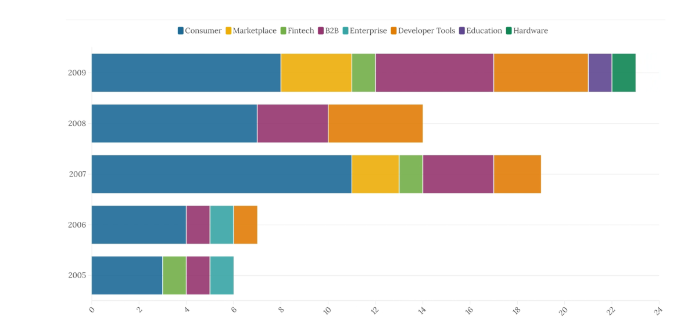

# 🚀 Y Combinator Companies & Evolution of Startup Ecosystem

  
*A data visualization project analyzing the impact of Y Combinator-funded startups on the global startup ecosystem.*

---

## 📖 Overview  

Y Combinator (YC) is one of the most influential startup accelerators, funding over 4,000 startups, including **Airbnb, Dropbox, Stripe, and Reddit**. This project explores YC's growth, trends in venture capital (VC) investments, and the success rate of incubated companies using **data analytics and visualization techniques**.  

📺 **Project Video:** [Click Here](https://shorturl.at/kBN04)  

---

## 📂 Table of Contents  
- [Data Sources](#data-sources)  
- [Tools & Technologies Used](#tools--technologies-used)  
- [Visualizations](#visualizations)  
  - [Pie Charts](#pie-charts)  
  - [Bar Graphs](#bar-graphs)  
  - [Column Charts](#column-charts)  
  - [Bubble Graphs](#bubble-graphs)  
  - [Geographical Maps](#geographical-maps)  
- [Challenges & Solutions](#challenges--solutions)  
- [Future Work](#future-work)  
- [Contributors](#contributors)  

---

## 📊 Data Sources  

We collected data from multiple sources:  
- **Crunchbase** (Company funding, M&A data)  
- **Y Combinator Directory** (List of funded startups)  
- **Kaggle Datasets** (YC-funded startup data, sector analysis)  
- **OECD & World Bank** (Venture capital investment trends & GDP data)  

---

## 🛠 Tools & Technologies Used  

| **Technology**      | **Purpose**  |
|---------------------|-------------|
| Python (Pandas)    | Data cleaning & preprocessing |
| Matplotlib, Seaborn | Static data visualizations |
| Geopandas          | Geographical maps |
| Flourish Studio    | Interactive race bar graphs |
| Animaker           | Video creation for presentation |

---

## 📈 Visualizations  

### 🎯 **Pie Charts**  
#### **1. YC Startup Success Rate**  
- **Public Companies:** Startups that went public  
- **Acquired Companies:** M&A success stories  
- **Failed Companies:** Shut down startups  
- **Active Companies:** Running without IPO/acquisition  

  

---

### 📊 **Bar Graphs**  
#### **2. Sector-Wise Startup Trends (2005-2009)**  
- **Consumer Tech, SaaS, AI, FinTech trends before recession**  
- **Comparison of top-funded startup sectors**  

  

#### **3. Bar Chart Race: Startup Sector Growth (2005-2023)**  
- Animated visualization showing dominance of startup sectors over time  
- **E.g., Rise of FinTech & Crypto startups post-2015**  

  

---

### 📊 **Column Charts**  
#### **4. YC Startup Team Sizes**  
- Most startups had **small teams** (2-5 founders) at inception  

  

#### **5. Funding Rounds (Airbnb, Stripe, DoorDash, Reddit)**  
- Investment growth across **Seed → Series D rounds**  

  

---

### 🌍 **Bubble Graphs & Geographical Maps**  
#### **6. Motion Bubble Graph: GDP vs. VC Investments**  
- Countries with **high venture capital funding → high GDP growth** correlation  

  

#### **7. YC's Global Startup Hubs**  
- **Top 10 cities with the most YC-funded startups**  

  

---

## 🔍 Challenges & Solutions  

### ❌ **Challenge 1: Data Collection & Cleaning**  
✅ Solution: Used **Crunchbase API, Kaggle Datasets, and Web Scraping** to obtain structured data.  

### ❌ **Challenge 2: Missing Investment Data for Some Regions**  
✅ Solution: Supplemented with **OECD and World Bank data** on VC investments outside the US.  

### ❌ **Challenge 3: Pre-Recession Analysis (2005-2009)**  
✅ Solution: Manually cross-referenced YC's startup directory & historical financial reports.  

---

## 🚀 Future Work  

✔ **Use AI for trend prediction** in venture capital investments  
✔ **Analyze social media impact** on YC-funded startups’ success  
✔ **Sentiment analysis** on startup funding news articles  

---

## 👨‍💻 Contributors  

| Name | Role |
|------|------|
| **Rajat Mehta** | Project Direction, Data Collection, Cleaning, Visualizations, Report Writing |
| **Dhivya Kumaraguruparan** | Data Collection, Visualization, Report Writing |
| **Goutham Ganesh Rajan** | Data Cleaning, Visualization, Video Creation |

---

## 📜 License  
This project is licensed under the **MIT License**.

---
💡 **For questions or contributions, contact:** [mehta.rajat@northeastern.edu](mailto:mehta.rajat@northeastern.edu)  

Next Steps for You:
    1. Create an images/ folder in your GitHub repository.
    2. Upload the visualizations (graphs, charts, maps, etc.) you used in the report.
    3. Update the image paths in the README file to match the actual filenames.
    4. Push your repository to GitHub! 🎉
